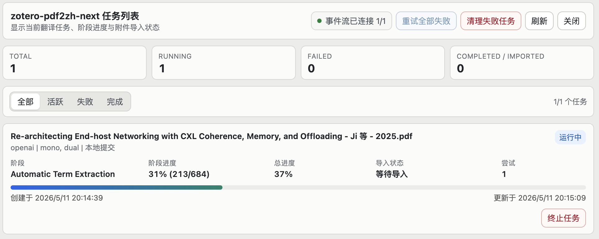

# zotero-pdf2zh-next

一个面向 Zotero 7 及以上版本的 PDF 翻译插件，配套一个本地 Python 服务来调用 `pdf2zh_next` 完成翻译。

项目维护重点是：少一点配置负担，稳定地在 Zotero 里提交任务、查看进度、导入结果。

当前统一版本：<!-- release-version --> `5.2.8`

## 目录

- [和原项目的区别](#和原项目的区别)
- [效果预览](#效果预览)
- [安装插件](#安装插件)
- [安装并启动本地服务](#安装并启动本地服务)
- [更新](#更新)
- [在 Zotero 里使用](#在-zotero-里使用)
- [License](#license)

## 和原项目的区别

本项目基于 `guaguastandup/zotero-pdf2zh` 演化而来，但现在按更轻量的方向维护：

- 只保留 Zotero 插件和本地 Python 服务两部分。
- 服务端提供 Homebrew 和 `uv tool` 分发，尽量减少手动配置。
- 支持任务面板、进度显示、取消、重试和结果导入状态。
- 支持同时输出中文 PDF 和双语 PDF。
- 偏好页整合插件版本、服务端版本、连接检查和常用翻译选项。
- 去掉旧 runner、旧 server 和历史遗留自动化路径，减少维护成本。

更新记录见 [CHANGELOG.md](CHANGELOG.md)。

## 效果预览



## 安装插件

从 GitHub Release 下载最新的 `zotero-pdf2zh-next.xpi`，然后：

1. 打开 Zotero。
2. 进入 `工具 -> 插件`。
3. 点击右上角齿轮图标。
4. 选择 `Install Add-on From File...`。
5. 选择下载的 `.xpi` 文件。
6. 重启 Zotero。

## 安装并启动本地服务

macOS 推荐使用 Homebrew，这样可以用 `brew services` 管理后台服务：

```bash
brew tap NightWatcher314/homebrew-formula
brew install zotero-pdf2zh-next
brew services start zotero-pdf2zh-next
```

Windows 和 Linux 可以使用 `uv tool`：

```bash
uv tool install --python 3.13 zotero-pdf2zh-next
zotero-pdf2zh-next
```

也可以用 Docker 启动本地服务：

```bash
docker compose up --build -d
```

如需在构建时使用自定义 Python 包索引或推送到自己的镜像仓库，可以通过环境变量覆盖默认值：

```bash
UV_INDEX_URL=https://your-pypi-proxy/index/ \
PDF2ZH_IMAGE=your-registry/zotero-pdf2zh-next:latest \
docker compose up --build -d
```

默认服务地址是：

```text
http://127.0.0.1:8890
```

## 更新

插件更新：

- 在 Zotero 的插件管理页面直接检查更新。
- 按 Zotero 提示完成更新并重启。

Homebrew 服务端更新：

```bash
brew update
brew upgrade zotero-pdf2zh-next
brew services restart zotero-pdf2zh-next
```

`uv tool` 服务端更新：

```bash
uv tool upgrade zotero-pdf2zh-next
```

## 在 Zotero 里使用

1. 打开 Zotero 设置里的 `zotero-pdf2zh-next`。
2. 把 `Python Server URL` 设为本地服务地址，例如 `http://127.0.0.1:8890`。
3. 点击“检查连接与配置”，确认插件端和服务端版本都能显示。
4. 选择翻译服务，并配置对应的 LLM API。
5. 选择输出中文 PDF、双语 PDF，或两者同时输出。
6. 在条目或 PDF 附件上右键，选择 `zotero-pdf2zh-next: Translate PDF`。

任务提交后，可以在右键菜单里打开 `zotero-pdf2zh-next: Task Manager` 查看进度、取消任务、重试失败任务和导入结果。

## License

本项目延续上游许可，采用 `AGPL-3.0-or-later` 发布，见 [LICENSE](LICENSE)。
